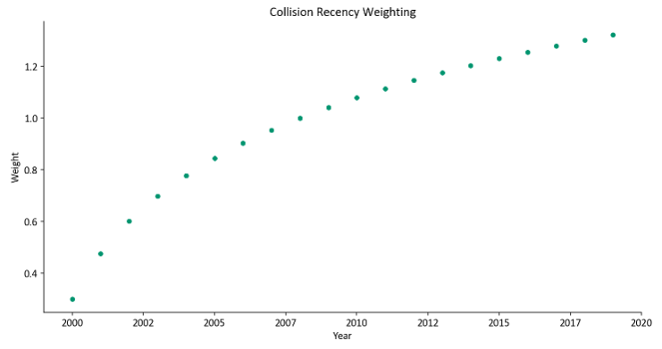
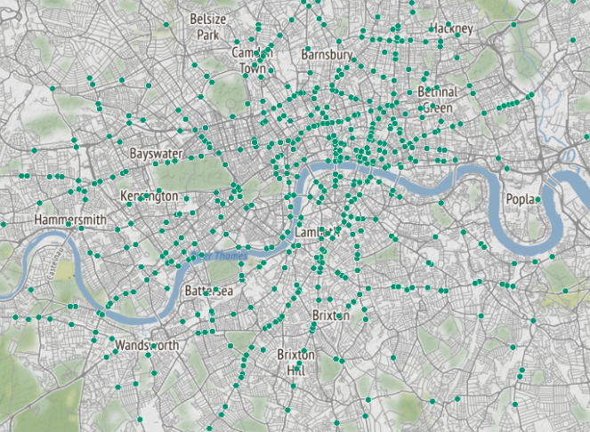
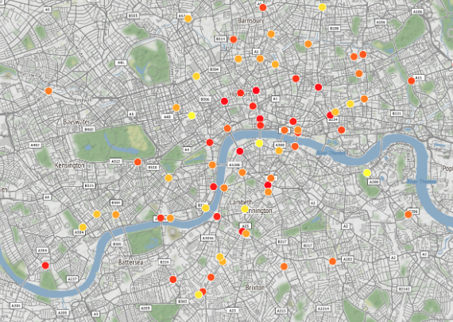

# LCC - Automatically Identifying Dangerous Junctions

This is a volunteer project aiming to help LCC better identify dangerous junctions for both cyclists and pedestrians in London. This is currently a manual process, where junctions are identified using [this tool](https://bikedata.cyclestreets.net/collisions/#9.54/51.5058/-0.1395). The currently identified junctions can be viewed [here](https://lcc.org.uk/campaigns/dangerous-junctions/).

The aim of this project is to use the [open source DfT collision data](https://www.data.gov.uk/dataset/cb7ae6f0-4be6-4935-9277-47e5ce24a11f/road-safety-data) to do this automatically. This is not a trivial problem since the collisions in the data are not tied to an identifiable junction name or code. Instead they are recorded using coordinates, which may vary even for collisison at the same junction. So the challenge is being able to link together collisions that happen at the same junction so that we can create some kind of danger metric at each junction.

Automatically identified junctions: [**interactive dangerous junctions map**](https://danielhills-lcc-dangerous-junctions-app-b63snl.streamlitapp.com/)

## The Approach

*__TODO__ - update this with new approach*

The current method used to identify dangerous junctions works as follows:
1. Filter to only 'severe' and 'fatal' collisions
2. Weight collisions so more recent and severe ones are upweighted:
    - If 'fatal': 3 * log(year - 1998)
    - If 'serious': log(year - 1998)
    


3. Cluster the collisions together using the DBSCAN clustering algorithm



4. Aggregate the collision weights at each junction to get a 'danger rank'



The main notebooks to follow for the above are:
- [dft-collision-data.ipynb](https://github.com/danielhills/lcc-dangerous-junctions/blob/main/notebooks/dft-collision-data.ipynb)
- [clustering-collisions.ipynb](https://github.com/danielhills/lcc-dangerous-junctions/blob/main/notebooks/clustering-collisions.ipynb) (probably won't render on GitHub)

An interactive app with junctions identified with this approach is [here](https://danielhills-lcc-dangerous-junctions-app-b63snl.streamlitapp.com/).

## Using this code

To run and develop on this code:
- Clone the repo
- Make sure Python installed
- Setup a virtual environment, e.g: ```python3 -m venv venv```
- Activate the virtual environment: `source/venv/activate`
- Install the packages using: `pip install -r requirements.txt`
- Run the following:
    - `python src/01-download-tfl-data.py` file to download and format the TfL data
    - `python src/02-filter-data.py` to filter the data to London etc.
    - `python src/03-build-junctions-graph.py` to build junctions graph for London
    - `python src/04-map-collisions-to-graph.py` to map collision data to the closest junction in the London junction graph

You should now be setup to run the notebooks in `notebooks/` and the streamlit app. The streamlit app locally can be done using: `streamlit run app.py` and navigating to the local host port.
