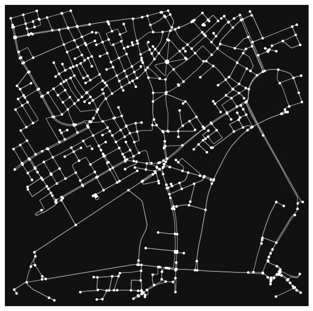

# Automatically Identifying Dangerous Junctions

This project aims to assist the LCC better identify dangerous junctions for both cyclists and pedestrians in London. This is currently a manual process, where junctions are identified using [this tool](https://bikedata.cyclestreets.net/collisions/#9.54/51.5058/-0.1395). The previously identified junctions can be viewed [here](https://lcc.org.uk/campaigns/dangerous-junctions/).

The aim of this project is to use the [open source TfL collision data](https://tfl.gov.uk/corporate/publications-and-reports/road-safety) to do this automatically. This is not a trivial problem since the collisions in the data are not tied to an identifiable junction name or code. Instead they are recorded using coordinates, which may vary even for collisisons at the same junction. So the challenge is being able to link together collisions that happen at the same junction so that we can create some kind of danger metric at each junction.

The junctions identified via this 'automatic' approach can be viewed in this [interactive app](https://lcc-dangerous-junctions.streamlit.app/). For more details on the approach, see section below.

## The Approach

The current method used to identify dangerous junctions works as follows:

1. Pull TfL data for the last 5 years, filter to collisions involving either a cyclist or pedestrian that occured at a junction
2. Generate junctions network for London, generated using the [OSMnx](https://github.com/gboeing/osmnx/tree/main). See example below for the junction network for Trafalgar Square.



3. Consolidate the junctions so those very close together are combined. For example we don't want every set of traffic lights on Trafalgar Square roundabout to be included as separate junctions. See example below of the junction network after the junctions have been combined:


4. Map each collision to their nearest junction using the [k-d tree algorithm](https://en.wikipedia.org/wiki/K-d_tree) with haversine distances

5. Weight each collision based on the most severe casualty type involved in the collision. The weights are consistent with those used by the Department for Transport, and are as follows:
    - Fatal - 6.8
    - Serious - 1
    - Slight - .06
      
6. Weight each collision based on how recent the collision was, since junctions may have changed in the last few years. The exact formula in Python is: `recency_weight = np.log10(year - min_year + 5)`. For example, a collision in 2020 where the minimum year in the data was 2018 would be weighted as: `log10(2020 - 2018 + 5) = log10(7) = .85`.

7. Aggregate the collisions across each junction to get a 'recency_danger_metric' for each junction. These are then ranked from highest to lowest to generate a list of the most dangerous junctions for either cyclists or pedestrians.

8. This data is then visualised in the [app](https://lcc-dangerous-junctions.streamlit.app/).
   
## Using this code

To run and develop on this code:
- Clone the repo
- Make sure Python installed
- Setup a virtual environment, e.g: ```python3.8 -m venv venv```
  - nb. the dependency `backports.zoneinfo` requires python version of max 3.8, see [docs](https://pypi.org/project/backports.zoneinfo/)
- Activate the virtual environment: `source venv/bin/activate`
- Install the packages using: `pip install -r requirements.txt`
  - nb. if you're adding new packages, add these to the requirements.in file and run `pip-compile requirements.in` (this updates the requirements.txt file)
- Run the following:
  - `python src/01-download-tfl-data.py` file to download and format the TfL data
  - `python src/02-filter-data.py` to filter the data to London etc.
  - `python src/03-build-junctions-graph.py` to build junctions graph for London
  - `python src/04-map-collisions-to-graph.py` to map collision data to the closest junction in the London junction graph

You should now be setup to run the notebooks in `notebooks/` and the streamlit app. The streamlit app locally can be done using: `streamlit run app.py` and navigating to the local host port.

## References

- [OSMnx](https://github.com/gboeing/osmnx/tree/main) - this package was used to generate the junction network for London, which the collisions are mapped to. Original paper:
> Boeing, G. 2017. "OSMnx: New Methods for Acquiring, Constructing, Analyzing, and Visualizing Complex Street Networks." Computers, Environment and Urban Systems 65, 126-139.

- Collision data is taken from TfL's "Collision data extracts" that can be accessed [here](https://tfl.gov.uk/corporate/publications-and-reports/road-safety)
